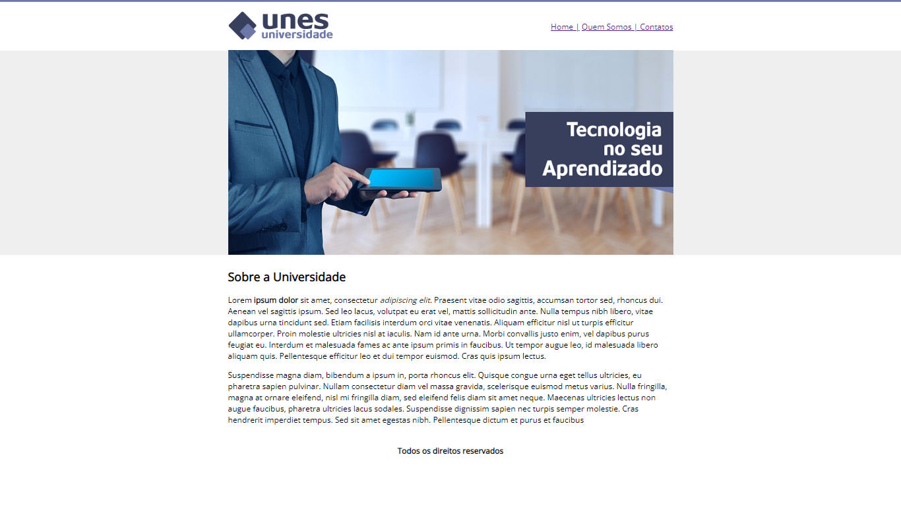

# PROJETO UNES UNIVERSIDADE

>Curso Udemy
Este foi um dos meus primeiros projetos em contato com HTML, em meados de 2020, tanto que foi utilizado tudo dentro do HTML ate a "customização" do site. 

## 📚 O que foi ensinado
- Estrutura de uma pagina WEB;
- Cabeçalho;
- Parágrafos (p);
- Formatação de Textos;
- adicionar Imagens (img);
- Adicionar Links (a href="");
- Tabelas
- Lista Ordenada e não Ordenada (ol e ul);
- Formulário (form)
